# 스프링 핵심 원리 - 기본편
## 1. 예제 만들기

### 프로젝트 생성

- 추가적인 dependency를 적용하지 않고, spring core만으로 프로젝트를 생성했다.


### 비즈니스 요구사항과 설계

- 회원
  - 회원 가입 및 조회할 수 있다.
  - 회원은 일반과 VIP 두 가지 등급이 있다.
  - 회원 데이터는 자체 DB를 구축할 수 있고, 외부 시스템과 연동할 수 있다.(미확정)
  
- 주문과 할인 정책
  - 회원은 상품을 주문할 수 있다.
  - 회원 등급에 따라 할인 정책을 적용할 수 있다.
  - 할인 정책은 모든 VIP는 1,000원을 할인해주는 고정 금액 할인을 적용해달라.(나중에 변경될 수 있다.)
  - 할인 정책은 변경 가능성이 높다. 회사의 기본 할인 정책을 아직 정하지 못했고, 오픈 직전까지 고민을 미루고 싶다. 최악의 경우 할인을 적용하지 않을 수도 있다.(미확정)


### 회원 도메인 설계


### 주문과 할인 도메인 설계

- 주문과 할인 정책
  - 회원은 상품을 주문할 수 있다.
  - 회원 등급에 따라 할인 정책을 적용할 수 있다.
  - 할인 정책은 모든 VIP는 1,000원을 할인해주는 고정 금액 할인을 적용해달라.(나중에 변경될 수 있다.)
  - 할인 정책은 변경 가능성이 높다. 회사의 기본 할인 정책을 아직 정하지 못했고, 오픈 직전까지 고민을 미루고 싶다. 최악의 경우 할인을 적용하지 않을 수도 있다.(미확정)


1. **주문 생성** : 클라이언트는 주문 서비스에 주문 생성을 요청한다.
2. **회원 조회** : 할인을 위해서는 회원 등급이 필요하다. 그래서 주문 서비스는 회원 저장소에서 회원을 조회한다.
3. **할인 적용** : 주문 서비스는 회원 등급에 따른 할인 여부를 할인 정책에 위임한다.
4. **주문 결과 반환** : 주문 서비스는 할인 결과를 포함한 주문 결과를 반환한다.


**역할과 구현을 분리**해서 자유롭게 구현 객체를 조립할 수 있게 설계했다. 덕분에 회원 저장소는 물론이고, 할인 정책도 유연하게 변경할 수 있다.


회원을 메모리에서 조회하고, 정액 할인 정책(고정 금액)을 지원해도 주문 서비스를 변경하지 않아도 된다. 역할들의 협력 관계를 그대로 재사용 할 수 있다.


회원을 메모리가 아닌 실제 DB에서 조회하고, 정률 할인 정책(주문 금액에 따라 % 할인)을 지원해도 주문 서비스를 변경하지 않아도 된다. 협력 관계를 그대로 재사용 할 수 있다.


## 2. 객체 지향 원리 적용

### 새로운 할인 정책 개발

##### 새로운 할인 정책을 확장해보자.

- **악덕 기획자** : 서비스 오픈 직전에 할인 정책을 지금처럼 고정 금액 할인이 아니라 좀 더 합리적인 주문 금액당 할인하는 정률(%) 할인으로 변경하고 싶어요. 예를 들어 기존 정책은 VIP가 10,000원을 주문하든 20,000원을 주문하든 항상 1,000원을 할인했는데, 이번에 새로 나온 정책은 10%로 지정해두면 고객이 10,000원 주문시 1,000원을 할인해주고, 20,000원을 주문시에 2,000원을 할인해주는 거에요!
- **순진 개발자** : 제가 처음부터 고정 금액 할인은 아니라고 했잖아요.
- **악덕 기획자** : 애자일 소프트웨어 개발 선언 몰라요? 계획을 따르기보다 변화에 대응하기를
- **순진 개발자** : ...(하지만 난 유연한 설계가 가능하도록 객체지향 설계 원칙을 준수했지)

> 참고 : 애자일 소프트웨어 개발 선언(https://agilemanifesto.org/iso/ko/manifesto.html)

순진 개발자가 정말 객체지향 설계 원칙을 잘 준수했는지 확인해보자. 이번에는 주문한 금액의 %를 할인해주는 새로운 정률 할인 정책을 추가하자.


### 새로운 할인 정책 적용과 문제점

##### 방금 추가한 할인 정책을 애플리케이션에 적용해보자.

할인 정책을 변경하려면 클라이언트인 `OrderServiceImpl` 코드를 고쳐야 한다.

```java
public class OrderServiceImpl implements OrderService {
    // private final DiscountPolicy discountPolicy = new FixDiscountPolicy();
    private final DiscountPolicy discountPolicy = new RateDiscountPolicy();
}
```

**문제점 발견**

- 우리는 역할과 구현을 충실하게 분리했다. → OK
- 다형성도 활용하고, 인터페이스와 구현 객체를 분리했다. → OK
- OCP, DIP 같은 객체지향 설계 원칙을 충실히 준수했다.
  - → 그렇게 보이지만 사실은 아니다.
- DIP : 주문서비스 클라이언트(`OrderServiceImpl`)은 `DiscountPolicy` 인터페이스에 의존하면서 DIP를 지킨것 같은데?
  - → 클래스 의존관계를 분석해보자. 추상(인터페이스) 뿐만 아니라 **구체(구현) 클래스**에도 의존하고 있다.
    - 추상(인터페이스) 의존 : `DiscountPolicy`
    - 구체(구현) 클래스 의존 : `FixDiscountPolicy`, `RateDiscountPolicy`
- OCP : 변경하지 않고 확장할 수 있다고 했는데!
  - → **지금 코드는 기능을 확장해서 변경하면, 클라이언트 코드에 영향을 준다!** 따라서 **OCP를 위반**한다.


**왜 클라이언트 코드를 변경해야 할까?**
클래스 다이어그램으로 의존관계를 분석해보자.
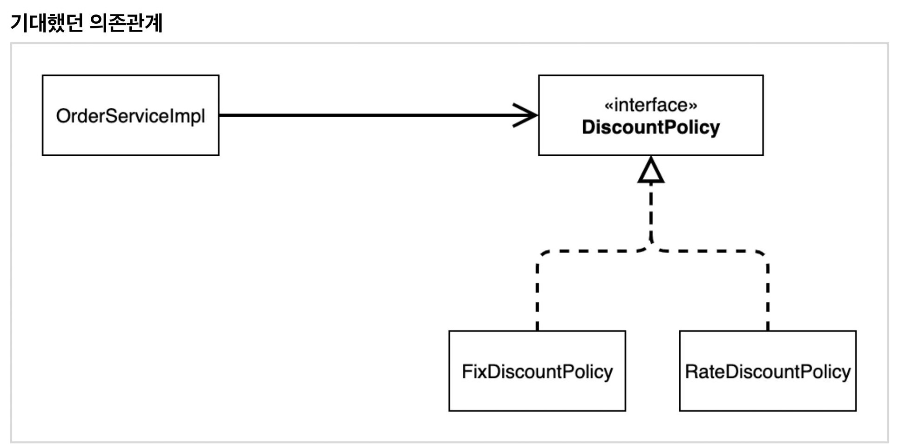
지금까지 단순히 `DiscountPolicy` 인터페이스마 의존한다고 생각했다.

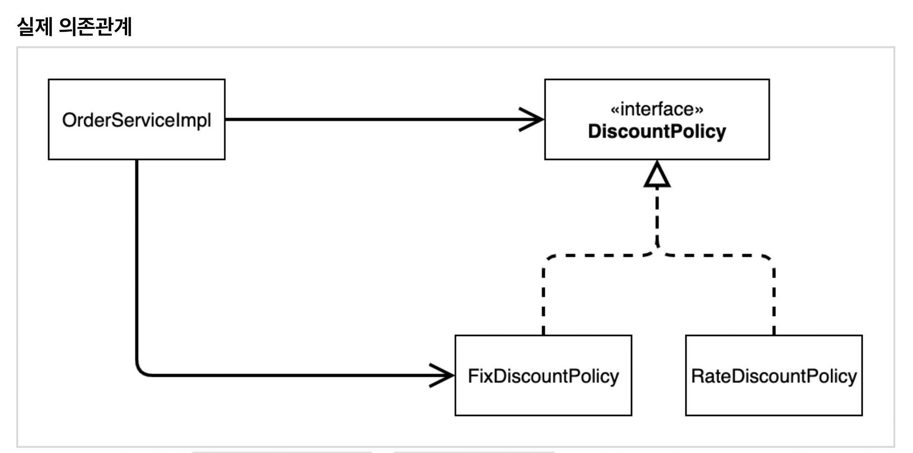
잘보면 클라이언트인 `OrderServiceImpl`이 `DiscountPolicy` 인터페이스 뿐만 아니라 `FixDiscountPolicy`인 구체 클래스도 함께 의존하고 있다. 실제 코드를 보면 의존하고 있다! **DIP 위반**

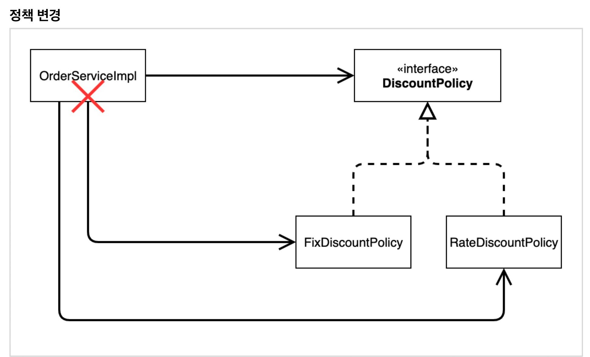

**중요!** 그래서 `FixDiscountPolicy`를 `RateDiscountPolicy`로 변경하는 순간 `OrderServiceImpl`의 소스코드도 함께 변경해야 한다! **OCP 위반**


**어떻게 문제를 해결할 수 있을까?**

- 클라이언트 코드인 `OrderServiceImpl`은 `DiscountPolicy`의 인터페이스 뿐만 아니라 구체 클래스도 함께 의존한다.
- 그래서 구체 클래스를 변경할 때 클라이언트 코드도 함께 변경해야한다.
- **DIP 위반** → 추상에만 의존하도록 변경(인터페이스에만 의존)
- DIP를 위반하지 않도록 인터페이스에만 의존하도록 의존관계를 변경하면 된다.

**인터페이스에만 의존하도록 설계를 변경하자**
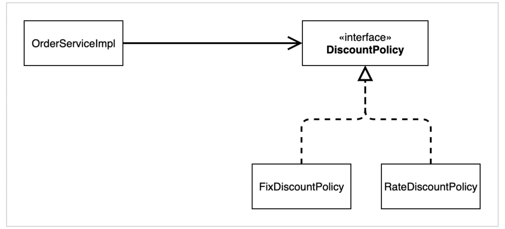


**인터페이스에만 의존하도록 코드 변경**

```java
public class OrderServiceImpl implements OrderService {
    // private final DiscountPolicy discountPolicy = new RateDiscountPolicy();
    private DiscountPolicy discountPolicy;
}
```

- 인터페이스에만 의존하도록 설계와 코드를 변경했다.
- **그런데 구현체가 없는데 어떻게 코드를 실행할 수 있을까?**
- 실제 실행을 해보면 NPE(null pointer exception)가 발생한다.


**해결방안**

- 이 문제를 해결하려면 누군가가 클라이언트인 `OrderServiceImpl`에 `DiscountPolicy`의 구현 객체를 대신 생성하고 주입해주어야 한다.


### 관심사의 분리

- 애플리케이션을 하나의 공연이라 생각해보자. 각각의 인터페이스를 배역(배우 역할)이라 생각하자. 그런데! 실제 배역에 맞는 배우를 선택하는 것은 누가 하는가?
- 로미오와 줄리엣 공연을 하던 로미오 역할을 누가 할지는 배우들이 정하는 게 아니다. 이전 코드는 마치 로미오 역할(인터페이스)을 하는 레오나르도 디카프리오(구현체, 배우)가 줄리엣 역할(인터페이스)을 하는 여자 주인공(구현체, 배우)를 직접 초빙하는 것과 같다. 디카프리오는 공연도 해야하고 동시에 여자 주인공도 공연에 직접 초빙해야 하는 **다양한 책임**을 가지고 있다.


**관심사를 분리하자**

- 배우는 본인의 역할인 배역을 수행하는 것에만 집중해야 한다.
- 디카프리오는 어떤 여자 주인공이 선택되더라도 똑같이 공연을 할 수 있어야 한다.
- 공연을 구성하고, 담당 배우를 섭외하고, 역할에 맞는 배우를 지정하는 책임을 담당하는 별도의 **공연 기획자**가 나올 시점이다.
- 공연 기획자를 만들고, 배우와 공연 기획자의 책임을 확실히 분리하자.


#### AppConfig의 등장

- 애플리케이션의 전체 동작 방식을 구성(config)하기 위해, **구현 객체를 생성**하고, **연결**하는 책임을 가지는 별도의 설정 클래스를 만들자.

  **AppConfig**

  ```java
  public class AppConfig {
      
      public MemberService memberService() {
          return new MemberServiceImpl(new MemoryMemberRepository());
      }
      
      public OrderService orderService() {
          return new OrderServiceImpl(
          	new MemoryMemberRepository(),
              new FixDiscountPolicy()
          );
      }
  }
  ```

- AppConfig는 애플리케이션의 실제 동작에 필요한 **구현 객체를 생성**한다.
  - `MemberServiceImpl`
  - `MemoryMemberRepository`
  - `OrderServiceImple`
  - `FixDiscountPolicy`
- AppConfig는 생성한 객체 인스턴스의 참조(레퍼런스)를 **생성자를 통해 주입(연결)**해준다.
  - `MemberServiceImpl` → `MemoryMemberRepository`
  - `OrderServiceImpl` → `MemoryMemberRepository`, `FixDiscountPolicy`


> 참고

지금은 각 클래스에 생성자가 없어서 컴파일 오류가 발생한다. 바로 다음에 코드에서 생성자를 만든다.


**MemberServiceImpl - 생성자 주입**

```java
public class MemberServiceImpl implements MemberService{

    private final MemberRepository memberRepository;

    public MemberServiceImpl(MemberRepository memberRepository) {
        this.memberRepository = memberRepository;
    }

    @Override
    public void join(Member member) {
        memberRepository.save(member);
    }

    @Override
    public Member findMember(Long memberId) {
        return memberRepository.findById(memberId);
    }
}
```

- 설계 변경으로 `MemberServiceImpl`은 `MemoryMemberRepository`를 의존하지 않는다.
- 단지 `MemberRepository` 인터페이스에만 의존한다.
- `MemberServiceImpl` 입장에서 생성자를 통해 어떤 구현 객체가 들어올지(주입될지)는 알 수 없다.
- `MemberServiceImpl`의 생성자를 통해서 어떤 구현 객체를 주입할지는 오직 외부(`AppConfig`)에서 결정된다.
- `MemberServiceImpl`은 이제부터 **의존관계에 대한 고민은 외부**에 맡기고 **실행에만 집중**하면 된다.


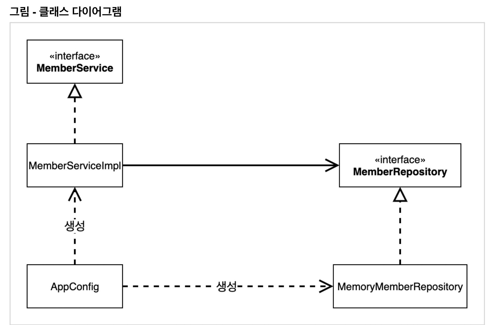

- 객체의 생성과 연결은 `AppConfig`가 담당한다.
- **DIP 완성** : `MemberServiceImpl`은 `MemberRepository`인 추상에만 의존하면 된다. 이제 구체 클래스를 몰라도 된다.
- **관심사의 분리** : 객체를 생성하고 연결하는 역할과 실행하는 역할이 명확히 분리되었다.


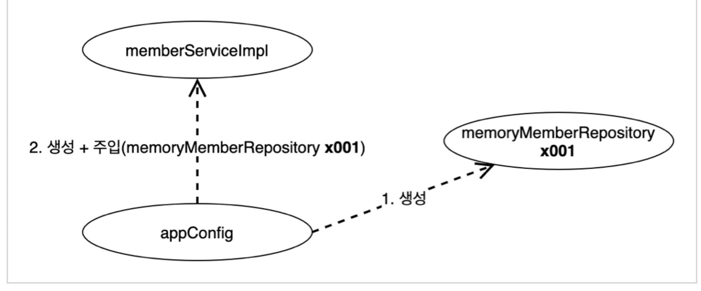

- `appConfig` 객체는 `memoryMemberRepository` 객체를 생성하고 그 참조값을 `memberServiceImpl`을 생성하면서 생성자로 전달한다.
- 클라이언트인 `memberServiceImpl` 입장에서 보면 의존관계를 마치 외부에서 주입해주는 것과 같다고 해서 DI(Dependency Injection) 우리말로 의존관계 주입 또는 의존성 주입이라고 한다.


**OrderServiceImpl - 생성자 주입**

```java
public class OrderServiceImpl implements OrderService{

    private final MemberRepository memberRepository;
    private final DiscountPolicy discountPolicy;

    public OrderServiceImpl(MemberRepository memberRepository, DiscountPolicy discountPolicy) {
        this.memberRepository = memberRepository;
        this.discountPolicy = discountPolicy;
    }

    @Override
    public Order createOrder(Long memberId, String itemName, int itemPrice) {
        Member member = memberRepository.findById(memberId);
        int discountPrice = discountPolicy.discount(member, itemPrice);

        return new Order(memberId, itemName, itemPrice, discountPrice);
    }
}
```

- 설계 변경으로 `OrderServiceImpl`은 `FixDiscountPolicy`를 의존하지 않는다.
- 단지 `DiscountPolicy` 인터페이스에만 의존한다.
- `OrderServiceImpl` 입장에서 생성자를 통해 어떤 구현 객체가 들어올지(주입될지)는 알 수 없다.
- `OrderServiceImpl`의 생성자를 통해서 어떤 구현 객체를 주입할지는 오직 외부(`AppConfig`)에서 결정한다.
- `OrderServiceImpl`은 이제부터 실행에만 집중하면 된다.
- `OrderServiceImpl`에는 `MemoryMemberRepository`, `FixDiscountPolicy` 객체의 의존관계가 주입된다.


#### AppConfig 실행

> 테스트 코드에서 `@BeforeEach`는 각 테스트를 실행하기 전에 호출된다.


**정리**

- AppConfig를 통해서 관심사를 확실하게 분리했다.
- 배역, 배우를 생각해보자.
- AppConfig는 공연 기획자다.
- AppConfig는 구체 클래스를 선택한다. 배역에 맞는 담당 배우를 선택한다. 애플리케이션이 어떻게 동작해야 할지 전체 구성을 책임진다.
- 이제 각 배우들은 담당 기능을 실행하는 책임만 지면 된다.
- `OrderServiceImpl`은 기능을 실행하는 책임만 지면 된다.


#### 새로운 구조와 할인 정책 적용

- 처음으로 돌아가서 정액 할인 정책을 정률% 할인 정책으로 변경해보자.
- FixDiscountPolicy → RateDiscountPolicy
- 어떤 부분만 변경하면 되겠는가?

**AppConfig의 등장으로 애플리케이션이 크게 사용 영역과 객체를 생성하고 구성(Configuration)하는 영역으로 분리되었다.**

**그림 - 사용, 구성의 분리**
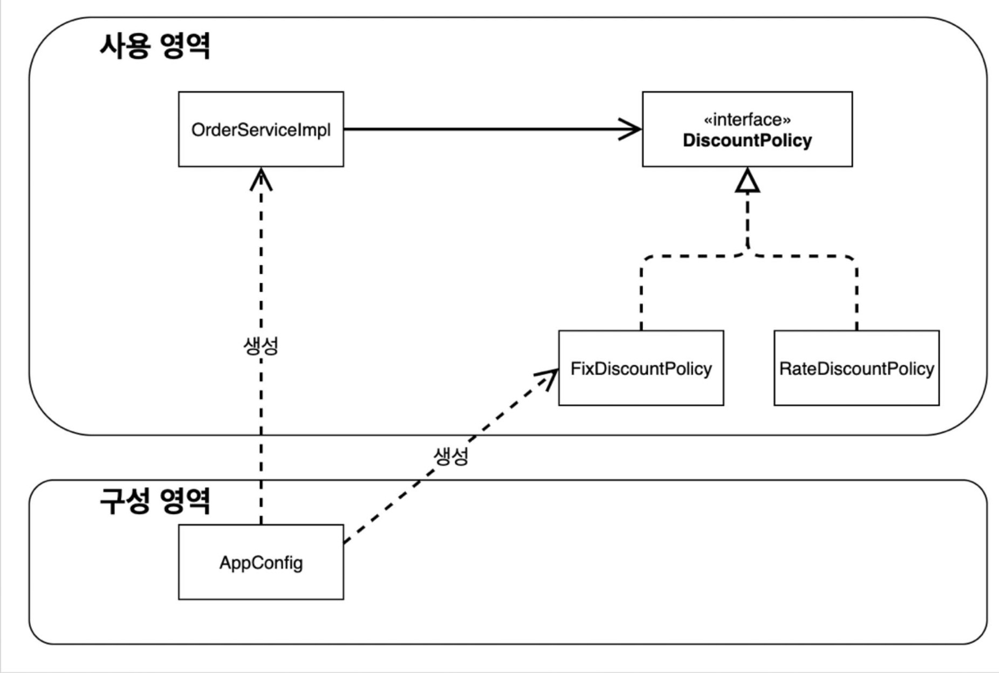


**그림 - 할인 정책의 변경**
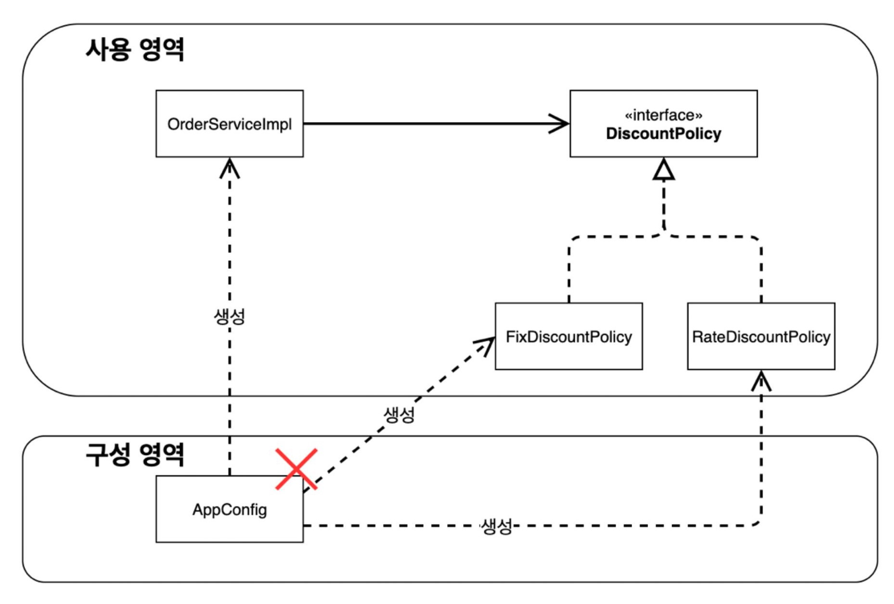

- `FixDiscountPolicy` → `RateDiscountPolicy`로 변경해도 구성 영역만 영향을 받고, 사용 영역은 전혀 영향을 받지 않는다.
- `AppConfig`에서 할인 정책 역할을 담당하는 구현을 `FixDiscountPolicy` → `RateDiscountPolicy` 객체로 변경했다.
- 이제 할인 정책을 변경해도, 애플리케이션의 구성 역할을 담당하는 AppConfig만 변경하면 된다. 클라이언트 코드인 `OrderServiceImpl`을 포함해서 **사용 영역**의 어떤 코드도 변경할 필요가 없다.
- **구성 영역**은 당연히 변경된다. 구성 역할을 담당하는 AppConfig를 애플리케이션이라는 공연 기획자로 생각하자. 공연 기획자는 공연 참여자인 구현 객체들을 모두 알아야 한다.


### 전체 흐름 정리

- 새로운 할인 정책 개발
- 새로운 할인 정책 적용과 문제점
- 관심사의 분리
- AppConfig 리팩터링
- 새로운 구조와 할인 정책 적용
  

**새로운 할인 정책 개발**

​	다형성 덕분에 새로운 정률 할인 정책 코드를 추가로 개발하는 것 자체는 아무 문제가 없음


**새로운 할인 정책 적용과 문제점**

​	새로 개발한 정률 할인 정책을 적용하려고 하니 **클라이언트 코드**인 주문 서비스 구현체도 함께 변경해야함
​	주문 서비스 클라이언트가 인터페이스인 `DiscountPolicy` 뿐만 아니라, 구체 클래스인 `FixDiscountPolicy`	도 함께 의존 → **DIP 위반**

**관심사의 분리**

- 애플리케이션을 하나의 공연으로 생각
- 기존에는 클라이언트가 의존하는 서버 구현 객체를 직접 생성하고 실행함
- 비유를 하면 기존에는 남자 주인공 배우가 공연도 하고, 동시에 여자 주인공도 직접 초빙하는 다양한 책임을 가지고 있음
- 공연을 구성하고, 담당 배우를 섭외·지정하는 책임을 별도로 담당하는 **공연 기획자**가 나올 시점
- 공연 기획자인 AppConfig가 등장
- AppConfig는 애플리케이션의 전체 동작 방식을 구성(Configuration)하기 위해 **구현 객체를 생성**하고, **연결**하는 책임
- 이제부터 클라이언트 객체는 자신의 역할을 실행하는 것만 집중, 권한이 줄어듬(책임이 명확해짐)
  

**AppConfig 리팩터링**

- 구성 정보에서 역할과 구현을 명확하게 분리
- 역할이 잘 드러남
- 중복 제거
  

**새로운 구조와 할인 정책 적용**

- 정액 할인 정책 → 정률% 할인 정책으로 변경
- AppConfig의 등장으로 애플리케이션이 크게 **사용 영역**과 객체를 생성하고 **구성(Configuration)하는 영역**으로 분리
- 할인 정책을 변경해도 AppConfig가 있는 구성 영역만 변경하면 됨. 사용 영역은 변경할 필요가 없음. 물론 클라이언트 코드인 주문 서비스 코드도 변경하지 않음


### 좋은 객체 지향 설계의 5가지 원칙 적용

> 여기서 3가지 SRP, DIP, OCP 적용


#### SRP 단일 책임의 원칙

**한 클래스는 하나의 책임만 가져야 한다.**

- 클라이언트 객체는 직접 구현 객체를 생성하고, 연결하고, 실행하는 다양한 책임을 가지고 있음
- SRP 단일 책임 원칙을 따르면서 관심사를 분리함
- 구현 객체를 생성하고 연결하는 책임은 AppConfig가 담당
- 클라이언트 객체는 실행하는 책임만 담당


#### DIP 의존관계 역전의 원칙

**프로그래머는 "추상화에 의존해야지, 구체화에 의존하면 안된다." 의존성 주입은 이 원칙을 따르는 방법 중 하나다.**

- 새로운 할인 정책을 개발하고 적용하려고 하니, 클라이언트 코드도 함께 변경해야 했다. 왜냐하면 기존 클라이언트 코드(`OrderServiceImpl`)는 DIP를 지키며 `DiscountPolicy` 추상화 인터페이스에 의존하는 것 같았지만, `FixDiscountPolicy` 구체화 구현 클래스에도 함께 의존했다.
- 클라이언트 코드가 `DiscountPolicy` 추상화 인터페이스에만 의존하도록 코드를 변경했다.
- 하지만 클라이언트 코드는 인터페이스만으로는 아무것도 실행할 수 없다.
- AppConfig가 `FixDiscountPolicy` 객체 인스턴스를 클라이언트 코드 대신 생성해서 클라이언트 코드에 의존관계를 주입했다. 이렇게 해서 DIP 원칙을 따르고 문제도 해결했다.


#### OCP 개방 폐쇄의 원칙

**소프트웨어 요소는 확장에는 열려 있으나 변경에는 닫혀 있어야 한다.**

- 다형성을 사용하고 클라이언트가 DIP를 지킴
- 애플리케이션을 사용 영역과 구성 영역을 나눔
- AppConfig가 의존관계를 `FixDiscountPolicy` → `RateDiscountPolicy`로 변경해서 클라이언트 코드에 주입하므로 클라이언트 코드는 변경하지 않아도 됨
- **소프트웨어 요소를 새롭게 확장해도 사용 영역의 변경은 닫혀 있다!**


### IoC, DI, 컨테이너

#### 제어의 역전 IoC(Inversion of Control)

- 기존 프로그램은 클라이언트 구현 객체가 스스로 필요한 서버 구현 객체를 생성-연결-실행 했다. 한마디로 구현 객체가 프로그램의 제어 흐름을 스스로 조종했다. 개발자 입장에서는 자연스러운 흐름이다.
- 반면에 AppConfig가 등장한 이후에 구현 객체는 자신의 로직을 실행하는 역할만 담당한다. 프로그램의 제어 흐름은 이제 AppConfig가 가져간다. 예를 들어서 `OrderServiceImpl`은 필요한 인터페이스들을 호출하지만 어떤 구현 객체들이 실행될지 모른다.
- 프로그램의 제어 흐름에 관한 권한은 모두 AppConfig가 가지고 있다. 심지어 `OrderServiceImpl`도 AppConfig가 생성한다. 그리고 AppConfig는 `OrderServiceImpl`이 아닌 OrderService 인터페이스의 다른 구현 객체를 생성하고 실행할 수도 있다. 그런 사실도 모른체 `OrderServiceImpl`은 묵묵히 자신의 로직을 실행할 뿐이다.
- 이렇듯 프로그램의 제어 흐름을 직접 제어하는 것이 아니라 외부에서 관리하는 것을 제어의 역전(IoC)이라 한다.


**프레임워크 vs 라이브러리**

- 프레임워크가 내가 작성한 코드를 제어하고 대신 실행한다면 그것은 프레임워크가 맞다. → ex) JUnit
- 반면에 내가 작성한 코드가 직접 제어의 흐름을 담당한다면 그것은 프레임워크가 아니라 라이브러리이다.


#### 의존관계 주입 DI(Dependency Injection)

- `OrderServiceImpl`은 `DiscountPolicy` 인터페이스에 의존한다. 실제 어떤 구현 객체가 사용될지는 모른다.

- 의존관계는 **정적인 클래스 의존 관계와 실행 시점에 결정되는 동적인 객체(인스턴스) 의존 관계** 둘을 분리해서 생각해야 한다.

  **정적인 클래스 의존 관계**

  클래스가 사용하는 import 코드만 보고 의존관계를 쉽게 판단할 수 있다. 정적인 의존 관계는 애플리케이션을 실행하지 않아도 분석할 수 있다. <u>클래스 다이어그램을 보자!</u>

  - `OrderServiceImpl`은 `MemberRepository`, `DiscountPolicy`에 의존한다는 것을 알 수 있다.
  - 그런데 이러한 클래스 의존 관계만으로는 실제 어떤 객체가 `OrderServiceImpl`에 주입될지 알 수 없다.

  **DI, 클래스 다이어그램**
  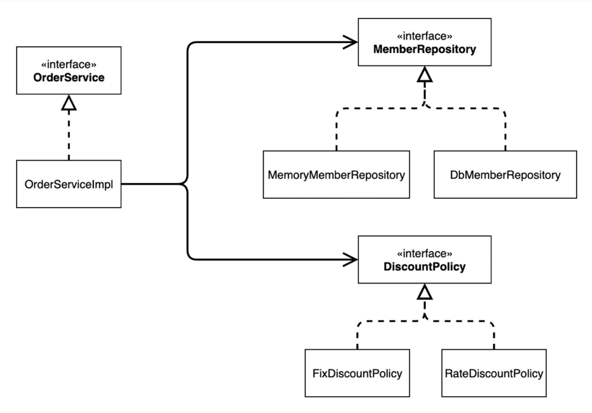**동적인 객체 인스턴스 의존 관계**

  애플리케이션 실행 시점에 실제 생성된 객체 인스턴스의 참조가 연결된 의존 관계

  **DI, 객체 다이어그램**

  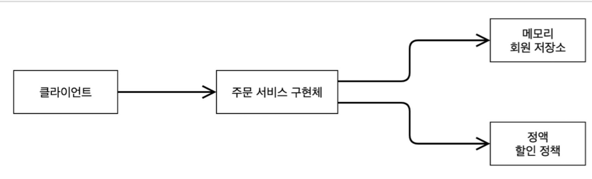

- 애플리케이션 **실행 시점(런타임)**에 외부에서 실제 구현 객체를 생성하고 클라이언트에 전달해서 클라이언트와 서버의 실제 의존 관계가 연결 되는 것을 **의존 관계 주입**이라고 한다.
- 객체 인스턴스를 생성하고, 그 참조값을 전달해서 연결한다.
- 의존 관계 주입을 사용하면 클라이언트 코드를 변경하지 않고, 클라이언트가 호출하는 대상의 타입 인스턴스를 변경할 수 있다.
- 의존 관계 주입을 사용하면 정적인 클래스 의존 관계를 변경하지 않고, 동적인 객체 인스턴스 의존 관계를 쉽게 변경할 수 있다.


**IoC 컨테이너, DI 컨테이너**

- AppConfig처럼 객체를 생성하고 관리하면서 의존 관계를 연결해주는 것을 **IoC 컨테이너** 또는 **DI 컨테이너**라고 한다.
- 의존 관계 주입에 초점을 맞추어 최근에는 주로 **DI 컨테이너**라고 한다.
- 어샘블러, 오브젝트 팩토리 등으로 불리기도 한다.


#### Spring 기반으로 변경

### pring 기반으로 변경

**AppConfig.java**

- AppConfig에 설정을 구성한다는 뜻의 `@Configuration`을 붙여준다.
- 각 메서드에 `@Bean`을 붙여준다. 이렇게 하면 스프링 컨테이너에 스프링 빈으로 등록한다.


**스프링 컨테이너**

- `ApplicationContext`를 스프링 컨테이너라 한다.
- 기존에는 개발자가 `AppConfig`를 사용해서 직접 객체를 생성하고 DI를 했지만, 이제부터는 스프링 컨테이너를 통해서 사용한다.
- 스프링 컨테이너는 `@Configuration`이 붙은 `AppConfig`를 설정(구성) 정보로 사용한다. 여기서 `@Bean`이라 적힌 메서드를 모두 호출해서 반한된 객체를 스프링 컨테이너에 등록한다. 이렇게 스프링 컨테이너에 등록된 객체를 **스프링 빈**이라 한다.
- 스프링 빈은 `@Bean`이 붙은 메서드의 이름을 스프링 빈의 이름으로 사용한다. → `memberService`, `orderService`
- 이전에는 개발자가 필요한 객체를 `AppConfig`를 사용해서 직접 조회했지만, 이제부터는 스프링 컨테이너를 통해서 필요한 스프링 빈(객체)를 찾아야 한다. 스프링 빈은 `ApplicationContext.getBean()` 메서드를 사용해서 찾을 수 있다.
- 기존에는 개발자가 직접 자바 코드로 모든 것을 했다면, 이제부터는 스프링 컨테이너에 객체를 스프링 빈으로 등록하고, 스프링 컨테이너에서 스프링 빈을 찾아서 사용하도록 변경되었다.
- 코드가 약간 더 복잡해진 것 같은데, 스프링 컨테이너를 사용하면 어떤 장점이 있을까?


## 3. 스프링 컨테이너와 스프링 빈

### 스프링 컨테이너 생성

```java
ApplicationContext applicationContext = new AnnotationConfigApplicationContext(AppConfig.class);
```

- `ApplicationContext`를 스프링 컨테이너라고 한다.
- `ApplicationContext`는 인터페이스이다.
- 스프링 컨테이너는 XML을 기반으로 만들 수 있고, annotation 기반의 자바 설정 클래스로 만들 수 있다.
- 직전에 `AppConfig`를 사용했던 방식이 annotation 기반의 자바 설정 클래스로 스프링 컨테이너를 만든 것이다.
- 자바 설정 클래스를 기반으로 스프링 컨테이너 `ApplicationContext`를 만들어 보자.
  - `new AnnotationConfigApplicationContext(AppConfig.class);`
  - 이 클래스는 `ApplicationContext` 인터페이스의 구현체이다.


> 참고) 더 정확히는 스프링 컨테이너를 부를 때 `BeanFactory`, `ApplicationContext`로 구분해서 이야기한다. 이 부분은 뒤에서 설명하겠다. `BeanFactory`를 직접 사용하는 경우는 거의 없으므로 일반적으로 `ApplicationContext`를 스프링 컨테이너라 한다.


#### 스프링 컨테이너 생성 과정

**1. 스프링 컨테이너 생성**
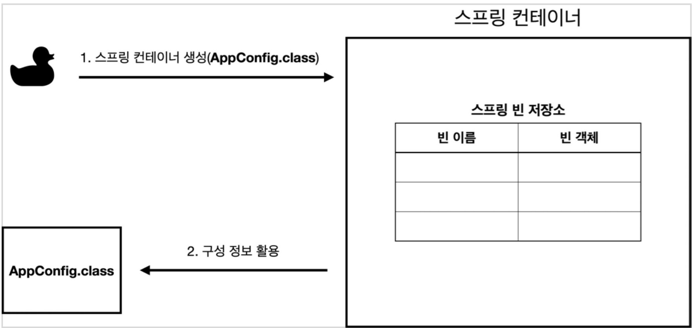

- `new AnnotationConfigApplicationContext(AppConfig.class)`
- 스프링 컨테이너를 생성할 때는 구성 정보를 지정해주어야 한다.
- 여기서는 `AppConfig.class`를 구성 정보로 지정했다.

**2. 스프링 빈 등록**
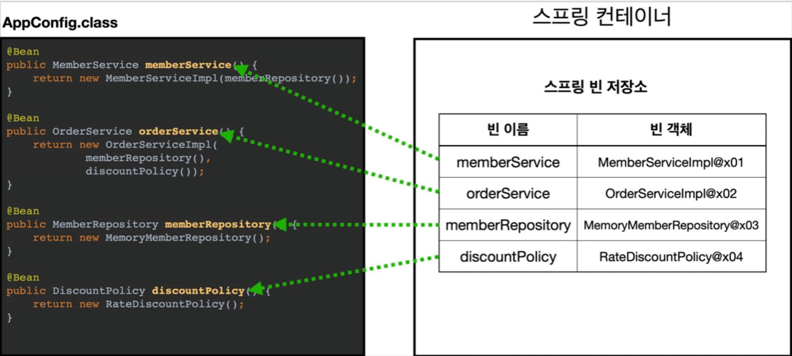

- 스프링 컨테이너는 파라미터로 넘어온 설정 클래스 정보를 사용해서 스프링 빈을 등록한다.

**빈 이름**

- 빈 이름은 메서드 이름을 사용한다.
- 빈 이름을 직접 부여할 수도 있다.
  - `@Bean(name="memberService2")`

> 주의) **빈 이름은 항상 다른 이름을 부여**해야 한다. 같은 이름을 부여하면, 다른 빈이 무시되거나 기존 빈을 덮어버리거나 설정에 따라 오류가 발생한다.


**3. 스프링 빈 의존 관계 설정 - 준비**
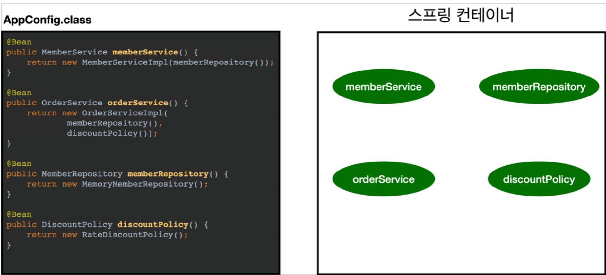


**4. 스프링 빈 의존 관계 설정 - 완료**
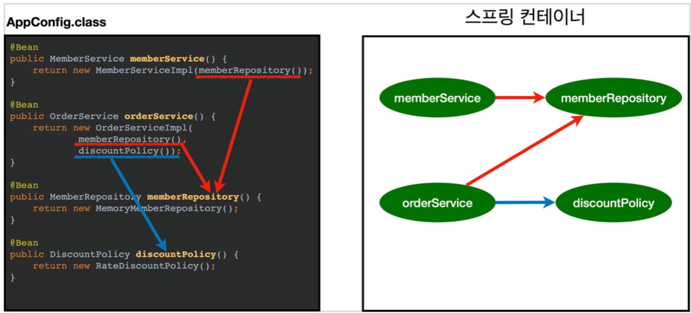

- 스프링 컨테이너는 설정 정보를 참고해서 의존 관계를 주입(DI)한다.
- 단순히 자바 코드를 호출하는 것 같지만, 차이가 있다. 이 차이는 뒤에 싱글톤 컨테이너에서 설명한다.


**참고**
스프링은 빈을 생성하고, 의존 관계를 주입하는 단계가 나누어져 있다. 그런데 이렇게 자바 코드로 스프링 빈을 등록하면 생성자를 호출하면서 의존 관계 주입도 한번에 처리된다. 여기서는 이해를 돕기 위해 개념적으로 나누어 설명했다. 자세한 내용은 의존 관계 자동 주입에서 다시 설명하겠다.


**정리**
스프링 컨테이너를 생성하고, 설정(구성) 정보를 참고해서 스프링 빈도 등록하고, 의존 관계도 설정했다. 이제 스프링 컨테이너에서 데이터를 조회해보자.


#### 컨테이너에 등록된 모든 빈 조회

스프링 컨테이너에 실제 스프링 빈들이 잘 등록 되었는지 확인해보자.

```java
class ApplicationContextInfoTest {
	AnnotationConfigApplicationContext ac = new AnnotationConfigApplicationContext(AppConfig.class);

    @Test
	@DisplayName("모든 빈 출력하기")
	void findAllBean() {
		String[] beanDefinitionNames = ac.getBeanDefinitionNames();
		for (String beanDefinitionName : beanDefinitionNames) {
			Object bean = ac.getBean(beanDefinitionName);
			System.out.println("name=" + beanDefinitionName + " object=" + bean);
		}
	}
    
	@Test
	@DisplayName("애플리케이션 빈 출력하기")
	void findApplicationBean() {
		String[] beanDefinitionNames = ac.getBeanDefinitionNames();
		for (String beanDefinitionName : beanDefinitionNames) {
			BeanDefinition beanDefinition = ac.getBeanDefinition(beanDefinitionName);

            //Role ROLE_APPLICATION: 직접 등록한 애플리케이션 빈
			//Role ROLE_INFRASTRUCTURE: 스프링이 내부에서 사용하는 빈
			if (beanDefinition.getRole() == BeanDefinition.ROLE_APPLICATION) {
                Object bean = ac.getBean(beanDefinitionName);
				System.out.println("name=" + beanDefinitionName + " object=" +
bean);
			}
		}
	}
}
```

- 모든 빈 출력하기
  - 실행하면 스프링에 등록된 모든 빈 정보를 출력할 수 있다.
  - `ac.getBeanDefinitionNames()` : 스프링에 등록된 모든 빈 이름을 조회한다.
  - `ac.getBean()` : 빈 이름으로 빈 객체(인스턴스)를 조회한다.
- 애플리케이션 빈 출력하기
  - 스프링이 내부에서 사용하는 빈은 제외하고, 내가 등록한 빈만 출력해보자.
  - 스프링이 내부에서 사용하는 빈은 `getRole()`으로 구분할 수 있다.
    - `ROLE_APPLICATION` : 일반적으로 사용자가 정의한 빈
    - `ROLE_INFRASTRUCTURE` : 스프링이 내부에서 사용하는 빈


#### 스프링 빈 조회 - 기본

스프링 컨테이너에서 스프링 빈을 찾는 가장 기본적인 조회 방법

- `ac.getBean(빈이름, 타입)`
- `ac.getBean(타입)`
- 조회 대상 스프링 빈이 없으면 예외 발생
  - `NoSuchBeanDefinitionException: No bean named 'xxxxx' available`

> 참고) 구체 타입으로 조회하면 변경시 유연성이 떨어진다.


#### 스프링 빈 조회 - 동일한 타입이 둘 이상

- 타입으로 조회 시 같은 타입의 스프링 빈이 둘 이상이면 오류가 발생한다. 이때는 빈 이름을 지정하자.
- `ac.getBeansOfType()`을 사용하면 해당 타입의 모든 빈을 조회할 수 있다.

