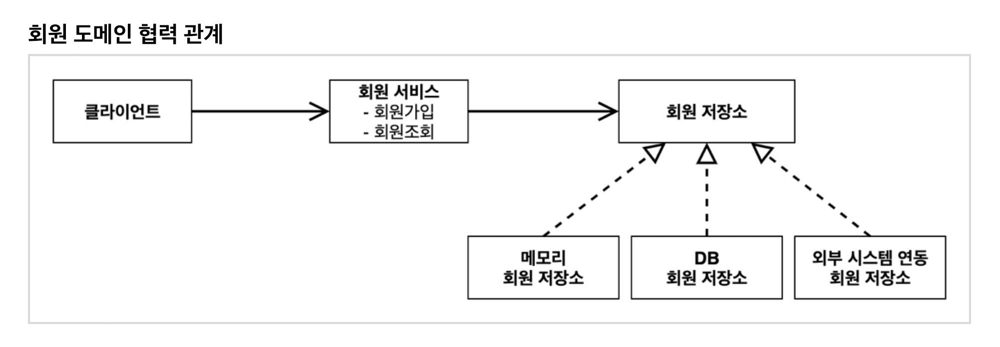
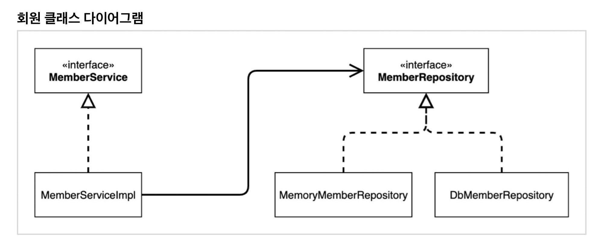
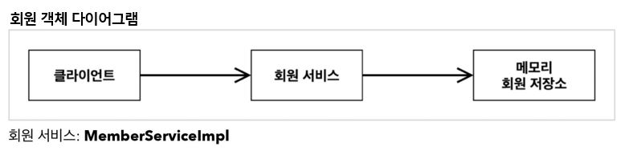
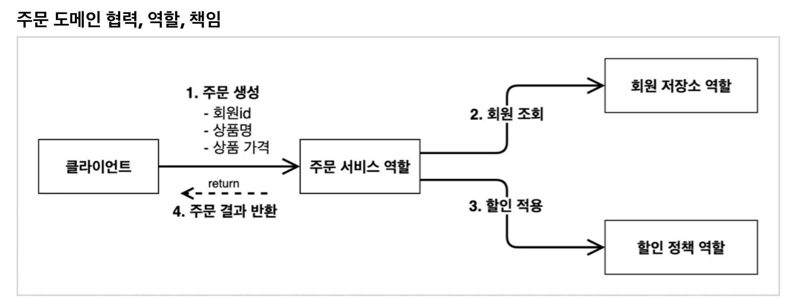
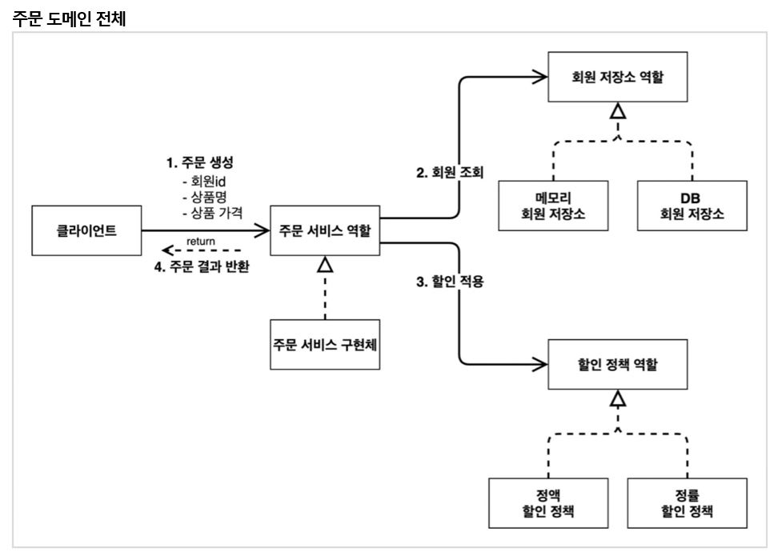
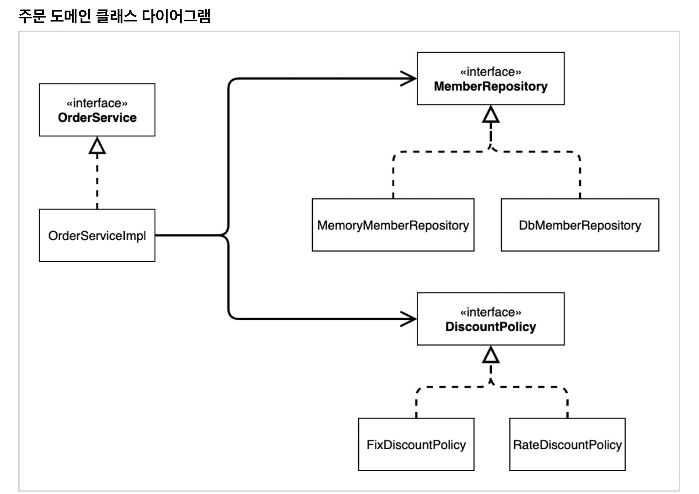
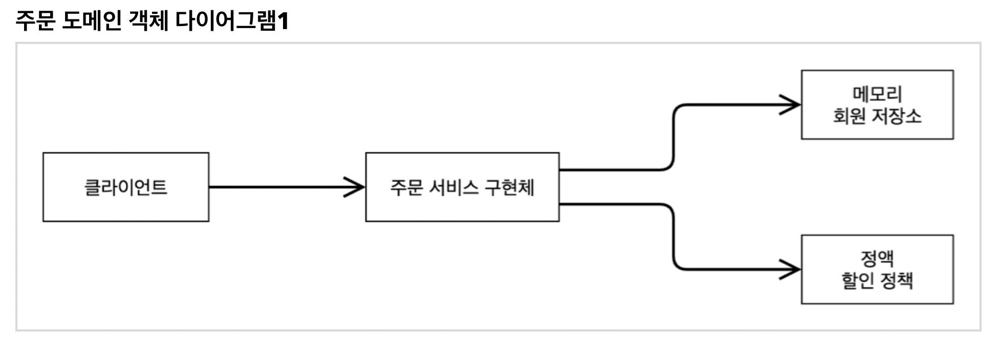
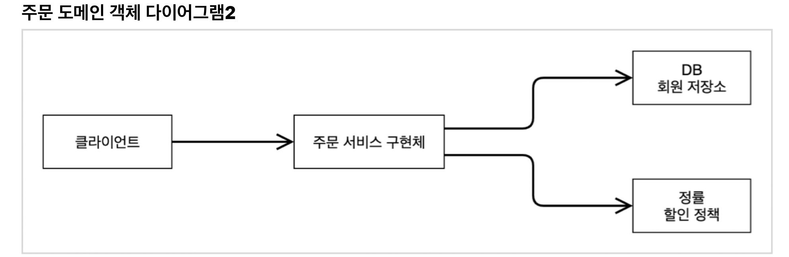
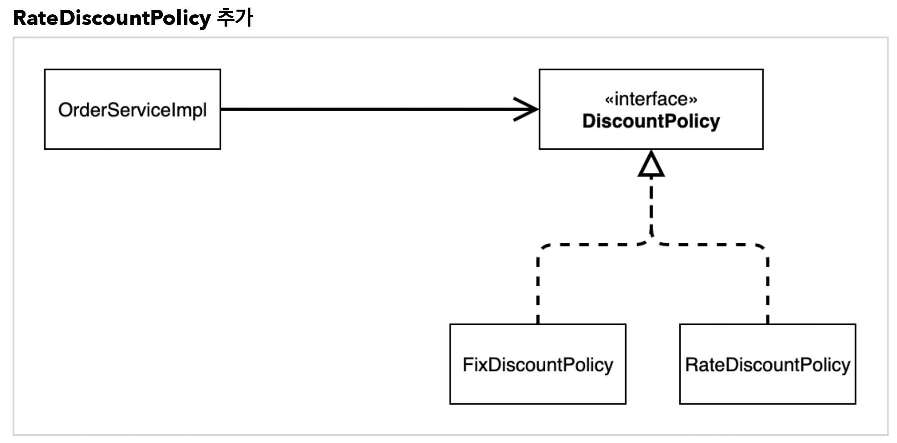

# 스프링 핵심 원리 - 기본편
### 프로젝트 생성
- 추가적인 dependency를 적용하지 않고, spring core만으로 프로젝트를 생성했다.

### 비즈니스 요구사항과 설계

- 회원
  - 회원 가입 및 조회할 수 있다.
  - 회원은 일반과 VIP 두 가지 등급이 있다.
  - 회원 데이터는 자체 DB를 구축할 수 있고, 외부 시스템과 연동할 수 있다.(미확정)
  
- 주문과 할인 정책
  - 회원은 상품을 주문할 수 있다.
  - 회원 등급에 따라 할인 정책을 적용할 수 있다.
  - 할인 정책은 모든 VIP는 1,000원을 할인해주는 고정 금액 할인을 적용해달라.(나중에 변경될 수 있다.)
  - 할인 정책은 변경 가능성이 높다. 회사의 기본 할인 정책을 아직 정하지 못했고, 오픈 직전까지 고민을 미루고 싶다. 최악의 경우 할인을 적용하지 않을 수도 있다.(미확정)

### 회원 도메인 설계

### 주문과 할인 도메인 설계

- 주문과 할인 정책
  - 회원은 상품을 주문할 수 있다.
  - 회원 등급에 따라 할인 정책을 적용할 수 있다.
  - 할인 정책은 모든 VIP는 1,000원을 할인해주는 고정 금액 할인을 적용해달라.(나중에 변경될 수 있다.)
  - 할인 정책은 변경 가능성이 높다. 회사의 기본 할인 정책을 아직 정하지 못했고, 오픈 직전까지 고민을 미루고 싶다. 최악의 경우 할인을 적용하지 않을 수도 있다.(미확정)

1. **주문 생성** : 클라이언트는 주문 서비스에 주문 생성을 요청한다.
2. **회원 조회** : 할인을 위해서는 회원 등급이 필요하다. 그래서 주문 서비스는 회원 저장소에서 회원을 조회한다.
3. **할인 적용** : 주문 서비스는 회원 등급에 따른 할인 여부를 할인 정책에 위임한다.
4. **주문 결과 반환** : 주문 서비스는 할인 결과를 포함한 주문 결과를 반환한다.

**역할과 구현을 분리**해서 자유롭게 구현 객체를 조립할 수 있게 설계했다. 덕분에 회원 저장소는 물론이고, 할인 정책도 유연하게 변경할 수 있다.

회원을 메모리에서 조회하고, 정액 할인 정책(고정 금액)을 지원해도 주문 서비스를 변경하지 않아도 된다. 역할들의 협력 관계를 그대로 재사용 할 수 있다.

회원을 메모리가 아닌 실제 DB에서 조회하고, 정률 할인 정책(주문 금액에 따라 % 할인)을 지원해도 주문 서비스를 변경하지 않아도 된다. 협력 관계를 그대로 재사용 할 수 있다.

### 새로운 할인 정책 개발

	#### 	새로운 할인 정책을 확장해보자.

- **악덕 기획자** : 서비스 오픈 직전에 할인 정책을 지금처럼 고정 금액 할인이 아니라 좀 더 합리적인 주문 금액당 할인하는 정률(%) 할인으로 변경하고 싶어요. 예를 들어 기존 정책은 VIP가 10,000원을 주문하든 20,000원을 주문하든 항상 1,000원을 할인했는데, 이번에 새로 나온 정책은 10%로 지정해두면 고객이 10,000원 주문시 1,000원을 할인해주고, 20,000원을 주문시에 2,000원을 할인해주는 거에요!
- **순진 개발자** : 제가 처음부터 고정 금액 할인은 아니라고 했잖아요.
- **악덕 기획자** : 애자일 소프트웨어 개발 선언 몰라요? 계획을 따르기보다 변화에 대응하기를
- **순진 개발자** : ...(하지만 난 유연한 설계가 가능하도록 객체지향 설계 원칙을 준수했지)

> 참고 : 애자일 소프트웨어 개발 선언(https://agilemanifesto.org/iso/ko/manifesto.html)

순진 개발자가 정말 객체지향 설계 원칙을 잘 준수했는지 확인해보자. 이번에는 주문한 금액의 %를 할인해주는 새로운 정률 할인 정책을 추가하자.

